# PyPI Banner Generator - Ultimate Professional & Minimal

[](https://www.python.org/downloads/)
[](https://opensource.org/licenses/MIT)
[](https://github.com/mrbeandev/PYPI-Banner-Generator/issues)

An advanced, professional banner generator for PyPI packages that creates stunning, corporate-friendly banners with multiple themes and styles.

## 🌟 Features

- ✨ **12 Professional Themes**: From minimal to gradient to glassmorphism
- 🎨 **Multiple Generation Modes**: Single, batch, category-based generation
- 📦 **PyPI Integration**: Automatically fetches package metadata
- �️ **Auto Logo Integration**: Seamlessly includes package logos
- 🎯 **Interactive Interface**: User-friendly prompts and selections
- � **Batch Generation**: Generate multiple themes at once
- 📏 **Perfect Dimensions**: 1200x630px optimized for social media
- � **Zero Configuration**: Works out of the box

## 🚀 Quick Start

### Interactive Mode (Recommended)
```bash
python banner_generator.py
```

The interactive mode will guide you through:
1. **Package Selection**: Enter any PyPI package name
2. **Generation Mode**: Choose single, multiple, all, or category
3. **Theme Selection**: Pick from 12 professional themes
4. **Automatic Generation**: Sit back and watch the magic happen

### Available Themes

#### 🏢 Professional Category
1. **Professional Light** - Clean white background, corporate style
2. **Professional Dark** - Dark slate background, modern tech style

#### 🎯 Minimal Category  
3. **Minimal Clean** - Ultra-clean design, maximum whitespace
4. **Minimal Dark** - Dark minimal design, subtle elegance

#### 🌈 Gradient Category
5. **Gradient Blue** - Blue to purple gradient, vibrant
6. **Gradient Purple** - Purple to pink gradient, creative
7. **Gradient Sunset** - Orange to yellow gradient, warm
8. **Gradient Ocean** - Blue to cyan gradient, cool

#### 🔮 Modern Category
9. **Modern Glassmorphism** - Glassmorphism effect with blur, trendy
10. **Neon Cyber** - Neon cyberpunk style, electric
11. **Material Design** - Google Material Design inspired
12. **Retro Synthwave** - 80s synthwave aesthetic, nostalgic

## 🎨 Theme Showcase

Here are examples of all 12 themes using the popular `requests` package:

### 🏢 Professional Category

| Professional Light | Professional Dark |
|:------------------:|:-----------------:|
| 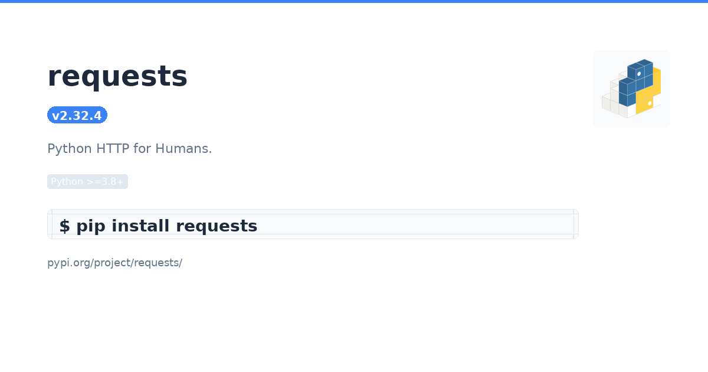 | 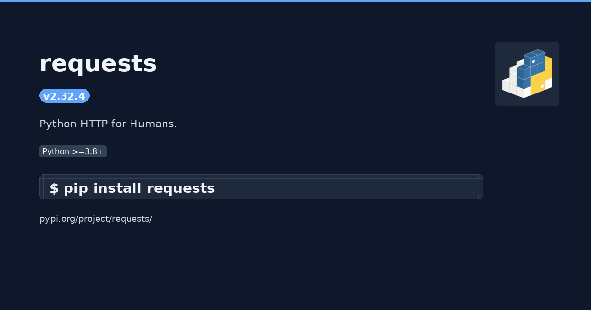 |
| Clean corporate style with white background | Modern tech style with dark background |

### 🎯 Minimal Category

| Minimal Clean | Minimal Dark |
|:-------------:|:------------:|
| 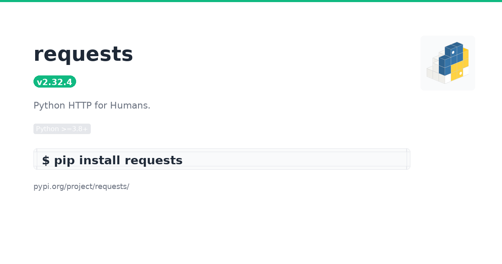 | 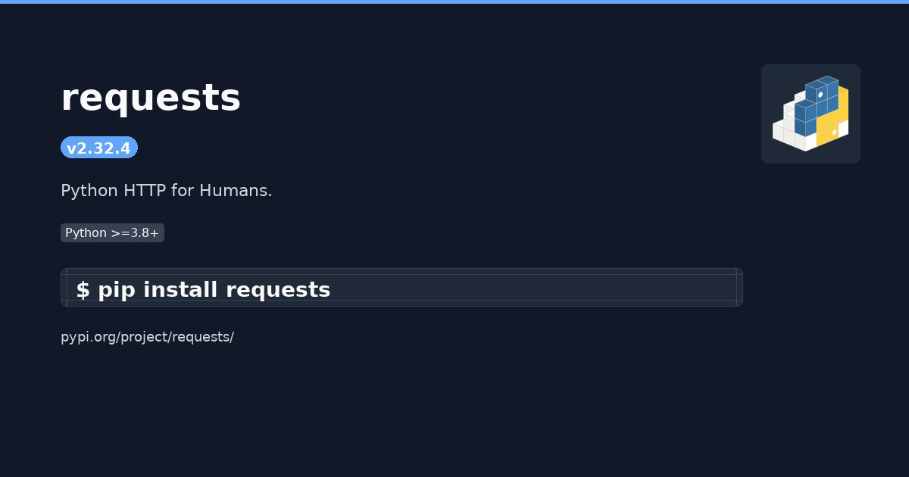 |
| Ultra-clean with maximum whitespace | Sophisticated dark minimal design |

### 🌈 Gradient Category

| Gradient Blue | Gradient Purple |
|:-------------:|:---------------:|
| 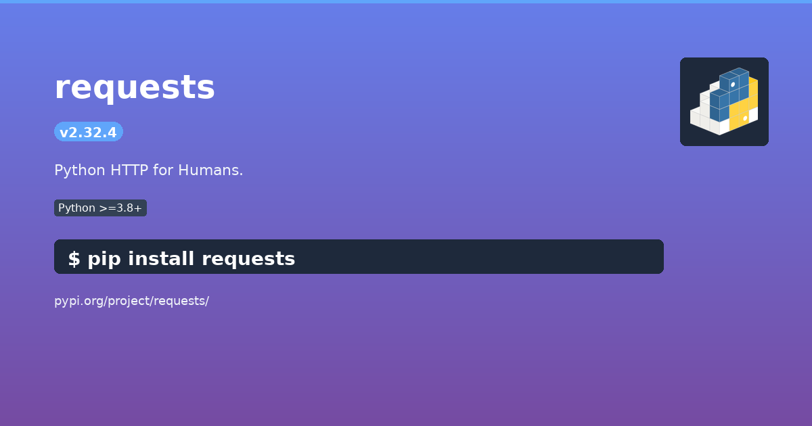 | 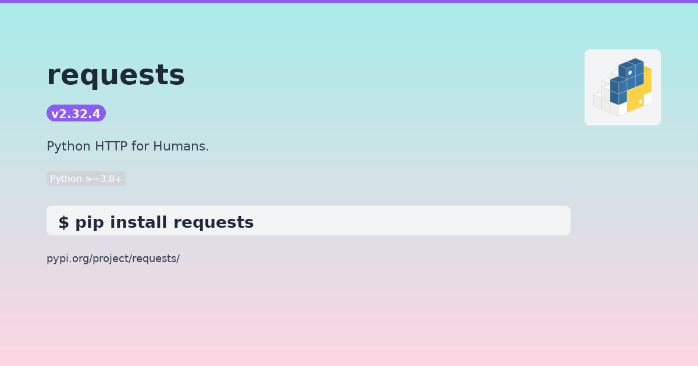 |
| Vibrant blue to purple gradient | Creative purple to pink gradient |

| Gradient Sunset | Gradient Ocean |
|:---------------:|:--------------:|
| 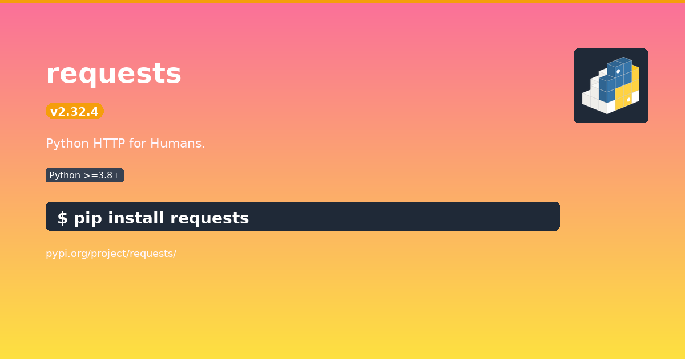 | 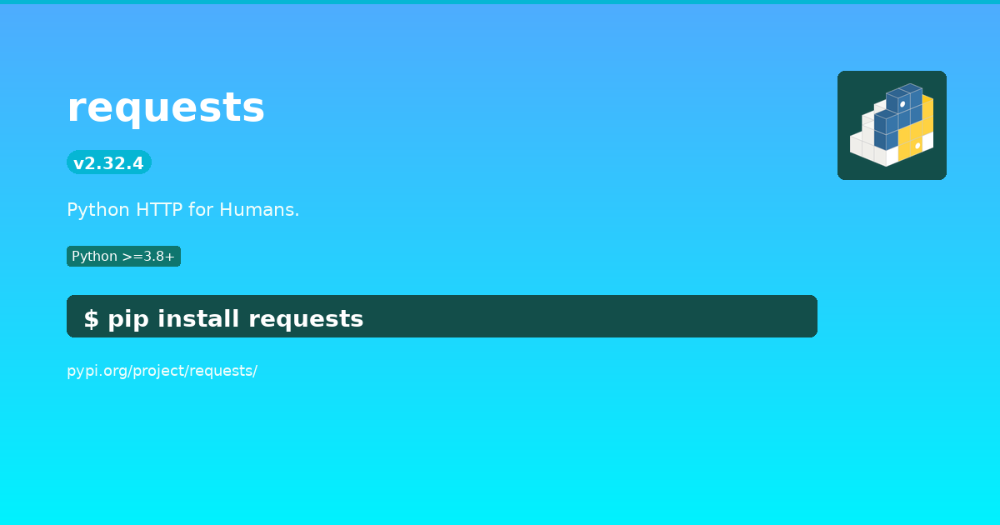 |
| Warm orange to yellow gradient | Cool blue to cyan gradient |

### 🔮 Modern Category

| Modern Glassmorphism | Neon Cyber |
|:-------------------:|:----------:|
| 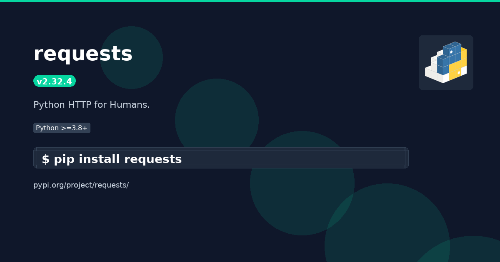 | 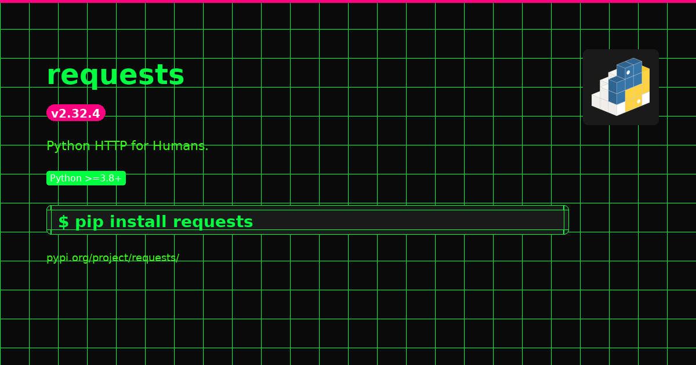 |
| Trendy glassmorphism with blur effect | Electric cyberpunk neon style |

| Material Design | Retro Synthwave |
|:---------------:|:---------------:|
| 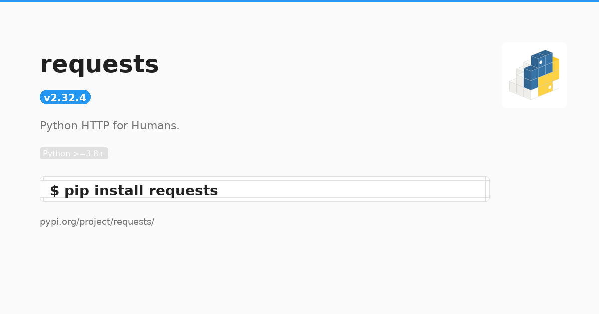 | 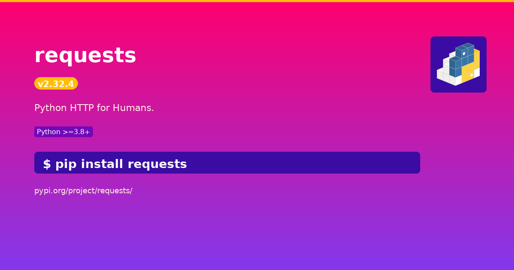 |
| Google Material Design inspired | 80s synthwave aesthetic with nostalgic vibes |

> **Note**: All banners are generated at 1200x630px resolution, perfect for social media platforms, GitHub README files, and documentation.

## 📋 Installation

```bash
# Clone the repository
git clone https://github.com/yourusername/PYPI-Banner-Generator.git
cd PYPI-Banner-Generator

# Install dependencies
pip install -r requirements.txt

# Run the generator
python banner_generator.py
```

## 🎨 Generation Modes

### Single Theme Mode
Perfect for specific branding requirements. Choose one theme and generate a focused banner.

### Multiple Themes Mode
Select several themes to compare different styles. Great for A/B testing or providing options.

### All Themes Mode
Generate all 12 themes at once. Perfect for comprehensive brand asset creation.

### Category Mode
Generate all themes from a specific category (Professional, Minimal, Gradient, or Modern).

## 📐 Technical Specifications

- **Dimensions**: 1200x630px (perfect for social media)
- **Format**: PNG with high quality
- **Color**: RGB color space
- **Typography**: DejaVu Sans font family
- **Logo**: Auto-integration if `pypi_logo.png` exists

## 🎯 What's Generated

Each banner includes:

- **Package Name**: Prominently displayed title
- **Version Badge**: Current version from PyPI
- **Description**: Wrapped text with proper formatting
- **Python Requirements**: Minimum Python version badge
- **Install Command**: Terminal-style installation guide
- **Project URL**: Clean URL display
- **Logo Integration**: Automatic logo placement (if available)

## Requirements

```bash
pip install -r requirements.txt
```

Dependencies:
- `pillow>=9.0.0` - Image processing
- `requests>=2.25.0` - PyPI API calls

## 📁 Project Structure

```
PYPI-Banner-Generator/
├── .github/                 # GitHub configuration
│   ├── workflows/ci.yml     # CI/CD pipeline
│   └── ISSUE_TEMPLATE/      # Issue templates
├── examples/                # Theme showcase images
│   ├── professional_light.png
│   ├── professional_dark.png
│   ├── minimal_clean.png
│   ├── minimal_dark.png
│   ├── gradient_blue.png
│   ├── gradient_purple.png
│   ├── gradient_sunset.png
│   ├── gradient_ocean.png
│   ├── modern_glassmorphism.png
│   ├── neon_cyber.png
│   ├── material_design.png
│   └── retro_synthwave.png
├── banner_generator.py      # Main application
├── requirements.txt         # Python dependencies
├── setup.py                # Package configuration
├── LICENSE                 # MIT license
├── README.md               # This file
├── CONTRIBUTING.md         # Contribution guidelines
├── .gitignore              # Git ignore rules
├── DejaVuSans-Bold.ttf     # Bold font
├── DejaVuSans.ttf          # Regular font
├── pypi_logo.png           # Default logo
└── output/                 # Generated banners directory
```

## 🚀 Usage Examples

### Example 1: Quick Single Banner
```bash
python banner_generator.py
# Enter: requests
# Choose: A (Single Theme)
# Select: 1 (Professional Light)
```

### Example 2: Multiple Themes
```bash
python banner_generator.py
# Enter: numpy
# Choose: B (Multiple Themes)
# Select: 1,2,5,9
```

### Example 3: All Gradients
```bash
python banner_generator.py
# Enter: django
# Choose: D (Category)
# Select: 3 (Gradient)
```

## 🎨 Customization

### Adding Custom Themes
Edit the `ALL_THEMES` dictionary in `banner_generator.py`:

```python
'13': {
    'name': 'my_custom_theme',
    'description': 'My awesome custom theme',
    'type': 'custom',
    'bg': '#ffffff',
    'primary': '#000000',
    'secondary': '#666666',
    'accent': '#ff6b35',
    'card': '#f8f9fa',
    'border': '#dee2e6'
}
```

### Custom Logo
Replace `pypi_logo.png` with your own logo. The generator will automatically detect and use it.

### Custom Fonts
Replace the font files (`DejaVuSans-Bold.ttf`, `DejaVuSans.ttf`) with your preferred fonts.

## Output

Generated banners are saved in the `output/` directory with timestamps and include:
- **Main banner**: 1200x630px (perfect for GitHub, social media)
- **High quality PNG**: Optimized file size

## 🤝 Contributing

1. Fork the repository
2. Create a feature branch: `git checkout -b feature-name`
3. Make your changes
4. Add tests if applicable
5. Commit your changes: `git commit -m 'Add feature'`
6. Push to the branch: `git push origin feature-name`
7. Submit a pull request

## 📄 License

This project is licensed under the MIT License - see the [LICENSE](LICENSE) file for details.

## 🙏 Acknowledgments

- Font: DejaVu Sans font family
- Inspiration: Modern design trends and PyPI community
- Built with: Python, Pillow (PIL), and lots of ☕

## 📞 Support

- 🐛 **Bug Reports**: [Open an issue](https://github.com/mrbeandev/PYPI-Banner-Generator/issues)
- 💡 **Feature Requests**: [Request a feature](https://github.com/mrbeandev/PYPI-Banner-Generator/issues)
- 💬 **Questions**: [Contact Developer](https://t.me/mrbeandev)

---

⭐ **Star this repo** if you find it useful! ⭐

*Made with ❤️ for the Python community*
